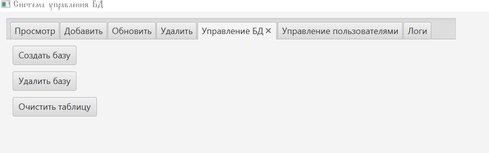

# Проект "Система управления базой данных для Frontend"

Это приложение реализовано на Java с использованием JDBC (интерфейс подключения к базе данных) и JavaFX (графический интерфейс пользователя, GUI (графический пользовательский интерфейс)). Проект позволяет управлять базой данных, содержащей информацию о frontend-фреймворках, с использованием хранимых процедур (stored procedures (хранимые процедуры)). Поддерживаются два режима доступа: **администратор** и **гость**, а также имеется функционал создания новых пользователей.


## Содержание
- [Требования](#требования)
- [Установка](#установка)
- [Настройка базы данных](#настройка-базы-данных)
- [Запуск проекта](#запуск-проекта)
- [Структура проекта](#структура-проекта)
- [Описание функционала](#описание-функционала)
- [Расширенный функционал](#расширенный-функционал)


## Требования
- **Java Development Kit (JDK)** (набор для разработки на Java, комплект разработки) версии 11 или выше.
- **PostgreSQL** (система управления базами данных) версии 10 или выше.
- **JavaFX** – библиотека для создания графических интерфейсов.
- **JDBC Driver for PostgreSQL** – драйвер для подключения к PostgreSQL.
- Любая среда разработки (например, IntelliJ IDEA, Eclipse или VS Code).


## Установка
1. **Установка Java:**
   - Скачайте и установите [JDK](https://www.oracle.com/java/technologies/javase-downloads.html).
2. **Установка PostgreSQL:**
   - Скачайте и установите PostgreSQL с [официального сайта PostgreSQL](https://www.postgresql.org/download/).
   - Во время установки задайте имя пользователя и пароль, которые будут использоваться для подключения к базе данных.
3. **Установка JavaFX:**
   - Скачайте JavaFX SDK с [официального сайта Gluon](https://gluonhq.com/products/javafx/).
   - Добавьте JavaFX библиотеки в зависимости (dependencies) вашего проекта.


## Настройка базы данных
1. **Создание базы данных и таблицы:**
   - Запустите PostgreSQL и подключитесь к нему (например, через pgAdmin или psql).
   - Выполните SQL-скрипт **stored_procedures.sql**, который содержит все необходимые хранимые процедуры для создания базы данных, таблицы и операций с данными.
2. **Пример запуска SQL-скрипта:**
   - Откройте pgAdmin и создайте новое подключение.
   - Вставьте содержимое файла **stored_procedures.sql** и выполните его.



## Запуск проекта
### Компиляция и запуск через командную строку
1. **Компиляция проекта:**
   Откройте терминал (cmd или терминал VS Code) и выполните:
   ```sh
   javac -d out --module-path "C:\javafx-sdk-23.0.2\lib" --add-modules javafx.controls,javafx.fxml -cp "lib/postgresql-42.7.5.jar" src/module-info.java src/application/*.java
   ```
   - `-d out` – указывает, что скомпилированные файлы будут сохранены в папке `out`.
   - `--module-path` – путь к библиотекам JavaFX.
   - `-cp` – добавляет PostgreSQL JDBC драйвер.


2. **Запуск приложения:**
   Выполните команду:
   ```sh
   java --module-path "C:\javafx-sdk-23.0.2\lib" --add-modules javafx.controls,javafx.fxml -cp "out;resources;lib/postgresql-42.7.5.jar" application.Main
   ```
   *На Linux/Mac вместо `;` используйте `:` для разделения путей в classpath.*


### Запуск через VS Code
1. **Настройте Classpath:**  
   Добавьте в VS Code папки `out`, `resources` и файл `lib/postgresql-42.7.5.jar`, а также путь к библиотекам JavaFX (например, `C:\javafx-sdk-23.0.2\lib`), используя команду **"Java: Configure Classpath"**.
2. **Создайте конфигурацию запуска:**  
   В папке `.vscode` создайте (или отредактируйте) файл `launch.json` со следующим содержимым:
   ```json
   {
     "version": "0.2.0",
     "configurations": [
       {
         "type": "java",
         "name": "Запуск JavaFX",
         "request": "launch",
         "mainClass": "application.Main",
         "vmArgs": "--module-path \"C:/javafx-sdk-23.0.2/lib\" --add-modules javafx.controls,javafx.fxml",
         "classPaths": [
           "out",
           "lib/postgresql-42.7.5.jar"
         ]
       }
     ]
   }
   ```
3. **Запустите приложение:**  
   Перейдите в раздел "Run & Debug" (Запуск и отладка) и выберите конфигурацию "Запуск JavaFX". Нажмите ▶️ (запуск).

### Авторизация в приложении
После запуска приложения откроется окно авторизации, где необходимо ввести следующие данные:

- **Для входа под учётной записью администратора (полный доступ):**  
  - **Логин:** `admin_user`  
  - **Пароль:** `admin123`
  
- **Для входа под учётной записью гостя (только просмотр):**  
  - **Логин:** `guest_user`  
  - **Пароль:** `guest123`

Эти данные должны соответствовать тем, что заданы в базе данных. Если вход не проходит, убедитесь, что пользователи созданы в PostgreSQL и их пароли установлены корректно (с помощью команд `ALTER ROLE` в psql или через pgAdmin).

## Структура проекта
- **stored_procedures.sql** – SQL-скрипт для создания базы данных, таблиц и хранимых процедур.
- **DBService.java** – класс для работы с базой данных, который реализует вызовы хранимых процедур.
- **Framework.java** – модель (model (модель)) для хранения данных о фреймворках.
- **LoginController.java** – контроллер для окна авторизации.
- **MainController.java** – контроллер для главного окна, где реализованы все операции с базой данных.
- **Main.java** – главный класс, запускающий приложение.
- **FXML файлы** – описание интерфейса для авторизации и главного окна (Login.fxml и Main.fxml).

## Описание функционала
- **Авторизация:** Вход осуществляется через окно авторизации, где вводятся имя пользователя и пароль. Доступ предоставляется согласно правам, заданным в базе данных.
- **Просмотр данных:** Вкладка с таблицей отображает все записи из таблицы.
- **Добавление записей:** Форма для добавления нового frontend-фреймворка.
- **Обновление записей:** Возможность изменить данные существующей записи.
- **Удаление записей:** Удаление записей по названию.
- **Поиск записей:** Поиск осуществляется по полю «название».
- **Управление базой данных:** Создание/удаление базы данных и очистка таблицы.
- **Управление пользователями:** Создание новых пользователей с назначением роли (администратор или гость).
- **Логирование:** Отображение логов (журнал (лог) действий) в отдельной вкладке.

## Расширенный функционал
- **Управление пользователями через GUI:** Создание нового пользователя осуществляется через специальную вкладку с выбором роли.
- **Логирование действий:** Каждое действие записывается в область логов для удобного отслеживания работы приложения.
- **Современный графический интерфейс:** Используется JavaFX для создания удобного и интуитивно понятного интерфейса.
- **Безопасность:** Ограничение доступа к функционалу реализовано на уровне базы данных через роли.

## Запуск и тестирование
1. **Тестирование авторизации:**
   - Запустите приложение и попробуйте войти под учетной записью администратора (`admin_user / admin123`) и гостя (`guest_user / guest123`).
2. **Работа с базой данных:**
   - Используйте вкладки для добавления, обновления, удаления и поиска записей.
   - Проверьте функционал создания новых пользователей через соответствующую вкладку.
3. **Логирование:**
   - Вкладка «Логи» отображает все действия, совершенные в приложении.

---

Следуя этим инструкциям, вы сможете установить, настроить и запустить приложение для управления базой данных в предметной области frontend. Если возникнут вопросы или проблемы, обратитесь к документации по [JavaFX](https://openjfx.io/) или [PostgreSQL](https://www.postgresql.org/docs/).